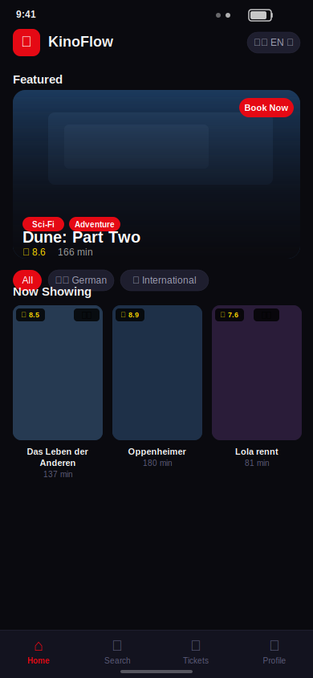
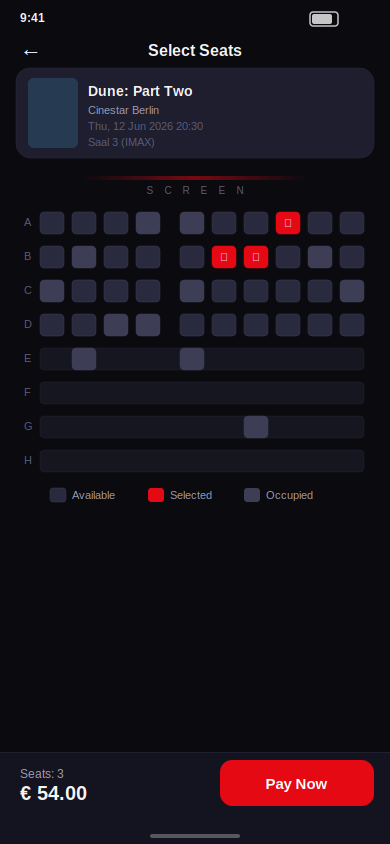
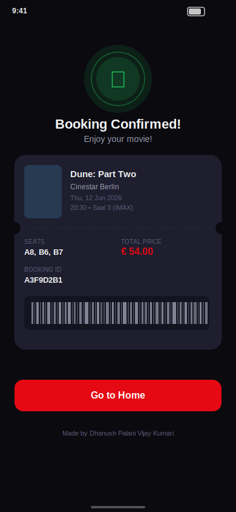

# 🎬 KinoFlow

**Cinema ticket booking application** built with Flutter.

---

## 📸 Screenshots

<p align="center">
  
  &nbsp;&nbsp;&nbsp;
  
  &nbsp;&nbsp;&nbsp;
  
</p>


---

## 📱 About

KinoFlow is a cross-platform cinema ticket booking app for Android and iOS. It features German and international films, bilingual support (English/German), seat selection.

---

## ✨ Features

- 🇩🇪🌍 **German & International films** — browse both categories
- 🌐 **Two language modes** — English and Deutsch (toggle in-app)
- 🎟️ **Seat selection** — interactive cinema seat grid (booked/available/selected)
- 📅 **Showtime selection** — multi-day, multi-cinema showtimes
- 🔐 **Firebase Authentication** — real login & register via `firebase_auth`
- 🗄️ **Cloud Firestore** — movies and bookings stored in Firestore with offline fallback
- 🌐 **REST API** — Dio + Retrofit integration for TMDB API (plug in your API key)
- 💾 **Local persistence** — SharedPreferences for offline-first caching
- 🗂️ **My Tickets** — upcoming vs past tabs, greyscale for past tickets
- 👤 **Profile** — user stats, EN↔DE language switcher, logout with confirmation
- 🔍 **Search** — live search by title, director, or genre
- 🎨 **Dark theme** — cinematic dark UI with KinoFlow red accent
- ✨ **Shimmer loading** — skeleton screens while data loads

---

## 🏗️ Architecture

```
lib/
├── core/
│   ├── constants/         # AppColors, AppTextStyles, AppConstants
│   ├── firebase/          # DefaultFirebaseOptions (FlutterFire config)
│   └── theme/             # AppTheme (dark)
├── data/
│   ├── datasources/       # MockMovieData (local fallback)
│   ├── repositories/      # MovieRepository, BookingRepository, AuthRepository
│   └── services/          # MovieApiService (Dio/Retrofit REST)
├── domain/
│   └── entities/          # Movie, Showtime, Booking, AppUser
├── presentation/
│   ├── blocs/             # MovieBloc, BookingBloc, AuthBloc, LocaleBloc
│   ├── pages/             # 11 screens
│   └── widgets/           # 6 reusable widgets
└── main.dart              # Firebase init + app entry + routing
```

**Clean Architecture** with BLoC state management, Repository pattern, and Dependency Injection via `MultiBlocProvider`.

---

## 🛠️ Tech Stack

| Layer | Technology |
|-------|-----------|
| Framework | Flutter (Dart) |
| State Management | `flutter_bloc` + `equatable` |
| Backend | Firebase Auth + Cloud Firestore |
| REST API | `dio` + `retrofit` (TMDB-compatible) |
| Local Storage | `shared_preferences` (offline cache) |
| Navigation | Named routes (`MaterialApp.onGenerateRoute`) |
| Localization | Flutter `gen-l10n` (ARB files) |
| Architecture | Clean Architecture + BLoC + Repository Pattern |
| Fonts | Poppins |

---

## 🌐 Localization

Two languages supported:

- **English** (`l10n/app_en.arb`)
- **Deutsch** (`l10n/app_de.arb`)

Toggle using the flag button anywhere in the app. Preference is persisted.

---

## 🎬 Movies

### 🇩🇪 German Films
Das Leben der Anderen · Lola rennt · Good Bye, Lenin! · Der Untergang · Das Parfum · Honig im Kopf

### 🌍 International Films
Oppenheimer · Dune: Part Two · The Zone of Interest · Poor Things · All Quiet on the Western Front · Past Lives · Anatomy of a Fall

---

## 🚀 Getting Started

### Prerequisites
- Flutter SDK `>=3.0.0`
- Dart SDK `>=3.0.0`
- Firebase project (see Firebase Setup above)

### Setup

```bash
# 1. Clone
git clone https://github.com/dhanush-pv/kinoflow.git
cd kinoflow

# 2. Install dependencies
flutter pub get

# 3. Generate localization files
flutter gen-l10n

# 4. Configure Firebase (see Firebase Setup section)
flutterfire configure

# 5. Run
flutter run
```

### Build

```bash
# Android APK
flutter build apk --release

# iOS
flutter build ios --release
```

---

## 📸 Screen Flow

```
Splash → Onboarding (first launch) → Login / Register
                                           ↓
                                     Home (browse movies)
                                           ↓
                              Movie Detail → Select Showtime
                                                   ↓
                                          Seat Selection → Confirmation

Home bottom nav: Home | Search | My Tickets | Profile
```

---

## 🔮 Future Improvements

- [ ] Push notifications (Firebase Cloud Messaging)
- [ ] Trailer playback (YouTube API)
- [ ] Google Maps for cinema locations
- [ ] More languages (Turkish, Spanish, French)

---

## 👤 Author

**Dhanush Palani Vijay Kumari**

---
